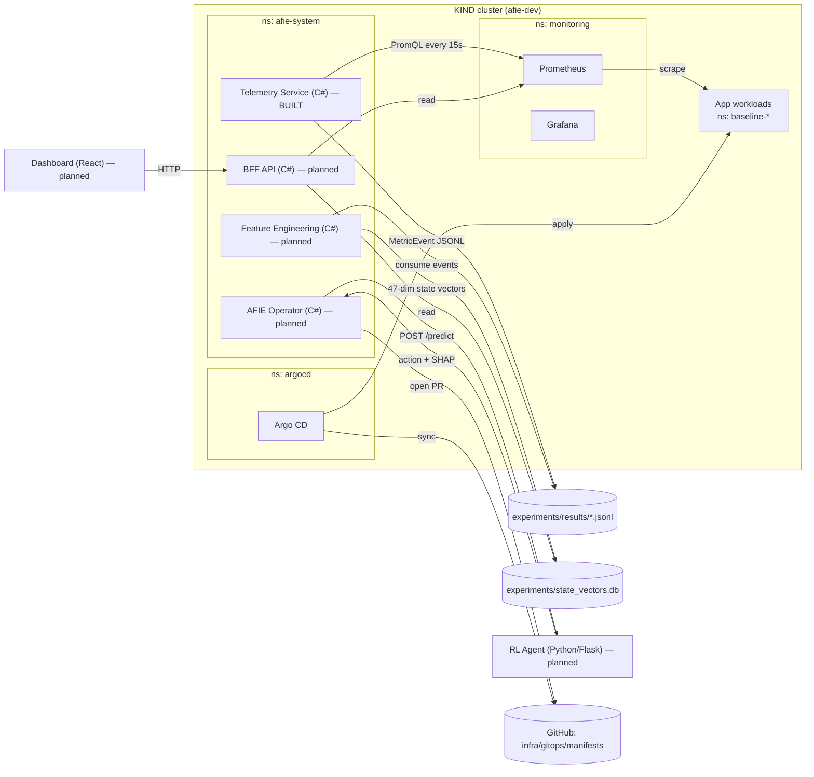
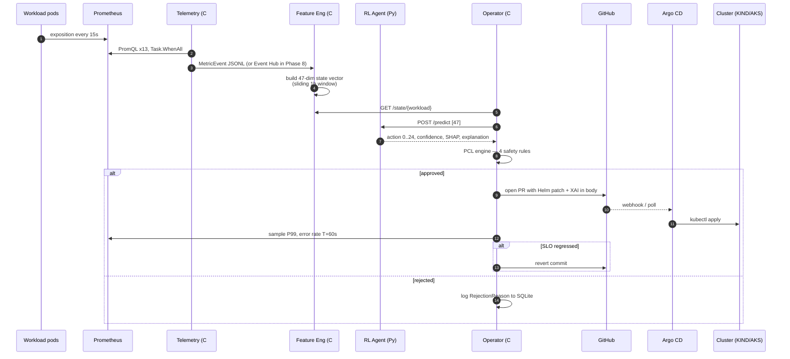

# System Architecture

## 1. Overview

AFIE closes a control loop over a Kubernetes cluster: it reads live workload
telemetry, decides whether resource requests/limits should change, validates
that decision against safety rules, and applies changes through Git so every
action is auditable and reversible.

The system is split into six independently deployable components and one
shared observability stack. Only the telemetry pipeline is fully implemented
today; the rest are described here as designed so the architecture is
coherent end-to-end.

## 2. High-level architecture

Legend: solid edges are implemented today wherever both endpoints are marked
BUILT; edges touching a `planned` node are the designed contract, not
runtime behaviour.

## 3. Components

| # | Component | Language / stack | Phase | Status | Purpose |
| - | --- | --- | --- | --- | --- |
| 1 | Telemetry Service | ASP.NET Core 8 | 3 | Built | Scrape Prometheus every 15s, publish `MetricEvent`s |
| 2 | Feature Engineering | ASP.NET Core 8 + MathNet | 4 | Planned | Convert `MetricEvent`s into the 47-dim state vector |
| 3 | RL Agent | Python 3.11, Stable-Baselines3, SHAP, Flask | 5 | Planned | PPO policy; serves `POST /predict`; SHAP explanations |
| 4 | AFIE Operator | .NET 8 + KubeOps + Octokit | 6 | Planned | Reconcile `ResourceRecommendation` CRDs, run PCL, open PRs |
| 5 | BFF API | ASP.NET Core 8 | 7 | Planned | Aggregate SQLite audit log + Prometheus for the UI |
| 6 | Dashboard | React 18 + Vite + shadcn/ui | 7 | Planned | Cost, action history, XAI, SLO heatmap, override |
| — | Observability | kube-prometheus-stack + Grafana | 2 | Built | Metrics store used by every component |
| — | GitOps | Argo CD (Flux swappable) | 2 | Built | Applies committed manifests to the cluster |

## 4. Data flow (steady state, all phases live)

## 5. The 47-dimensional state vector

The RL agent's observation space is `Box(-1, 1, shape=(47,))`. Feature
engineering is responsible for producing this vector exactly the same way
in training (from the Azure Public Dataset 2020) and in production (from
live `MetricEvent`s).

| Dims | Group | Content |
| --- | --- | --- |
| 0–8 | CPU | request, limit, P50/P95/P99 over 5m / 15m / 1h |
| 9–17 | Memory | same layout, memory in GiB before normalisation |
| 18–23 | App signals | req/s, error rate, P50/P95/P99 latency, 5m |
| 24–26 | Node pressure | CPU pressure, mem pressure, eviction proximity |
| 27–29 | Cost | $/hr estimate, 7-day trend, budget fraction |
| 30–34 | Temporal | sin/cos hour, sin/cos day-of-week, days-since-deploy |
| 35–37 | Deployment | replica count, HPA target, rolling-update flag |
| 38–46 | Action history | last 3 actions × (cost Δ, SLO Δ, minutes since) |

Cyclic encoding on temporal dims is load-bearing: hour 23 must be adjacent
to hour 0 in feature space. All values are clamped to `[-2, 2]` and NaN/Inf
are coerced to zero.

## 6. Action space and reward

- **Action space:** `Discrete(25)`. `levels = [-20, -10, 0, +10, +20]` percent.
  `cpu_adj = levels[a // 5]`, `mem_adj = levels[a % 5]`. Same layout for
  offline replay and live inference.
- **Reward:** `R = 0.5·cost_delta + 0.3·slo_compliance + 0.1·carbon_delta − 10.0·policy_violations`.
  The `policy_violations` coefficient is deliberately dominant — the agent
  should never learn to game the PCL.

## 7. Policy Constraint Language (PCL)

Every action from the RL agent passes through four rules before the
operator opens a PR:

1. `|adjustment| ≤ 20%` per axis (CPU, memory).
2. `new_limit ≥ P99_usage × 1.10` — leaves 10% headroom.
3. No rolling update currently in flight for that workload.
4. 30-minute cooldown since the last applied action on that workload.

The PCL is deliberately simple and boundary-testable. It is *not* the
place for ML — it is the audit boundary that a reviewer or SRE can read in
one page.

## 8. GitOps backend abstraction

The operator writes plain rendered manifests to
`infra/gitops/manifests/{workload}.yaml`. Both Argo CD (`Application`) and
Flux (`Kustomization`) can sync the same path. An `IGitOpsBackend`
abstraction (`ArgoBackend`, `FluxBackend`, `DirectApplyBackend`) hides the
difference — the health checker uses it to poll for sync + apply completion
before sampling SLOs for the rollback decision.

Never run Argo CD and Flux against the same path in the same cluster.

## 9. Deployment topology

**Development (Phases 1–7, current):** everything runs on a single KIND
cluster on the developer's MacBook. Cost: $0. Publishers write to local
files / SQLite; the RL agent runs as a local Flask process on
`localhost:5001`; the dashboard runs on Vite dev server at
`localhost:5173`.

**Production (Phases 8–9, planned):** Azure Event Hub replaces the file
sink for telemetry; Cosmos DB replaces SQLite for the audit log; Azure ML
optionally replaces the local Flask inference server (falls back to Flask
if the student subscription blocks it); Static Web Apps hosts the
dashboard. AKS is *not* used — the student subscription blocks it — so
the cluster stays on KIND for experiments and moves to any managed
Kubernetes only if the block is lifted. Migration is a redeploy of the
same manifests.

## 10. Technology choices — why

- **KubeOps** for the operator over Metacontroller / bare `client-go`: it
  gives idiomatic C# CRD controllers with generated typed clients, so the
  operator can share models with the telemetry service.
- **Stable-Baselines3 PPO** over a hand-rolled implementation: the paper's
  contribution is the environment + reward + PCL, not the RL algorithm.
  Using SB3 makes the results reproducible by any reviewer.
- **SHAP KernelExplainer** on the policy network: agnostic to model
  architecture, which keeps the door open to swap PPO for SAC or
  Decision Transformer later without rewriting explainability.
- **Argo CD (default), Flux (adapter):** Argo's visual sync dashboard is
  worth its weight for the paper demo; the Flux adapter exists so the
  approach isn't tied to a single controller.
- **Terraform (Phase 8) over Bicep/ARM:** cross-cloud, and a stronger CV
  signal for the author.

## 11. Non-goals (deliberate)

- **Autoscaling replicas.** AFIE tunes requests and limits. HPA / KEDA
  own replica count. The two are complementary.
- **Multi-cluster.** One cluster per AFIE instance. Federation is out of
  scope for the paper.
- **Realtime (<1s) reaction.** The 15s scrape cadence and 30-minute PCL
  cooldown are deliberate — the target is steady-state cost, not
  incident response.
