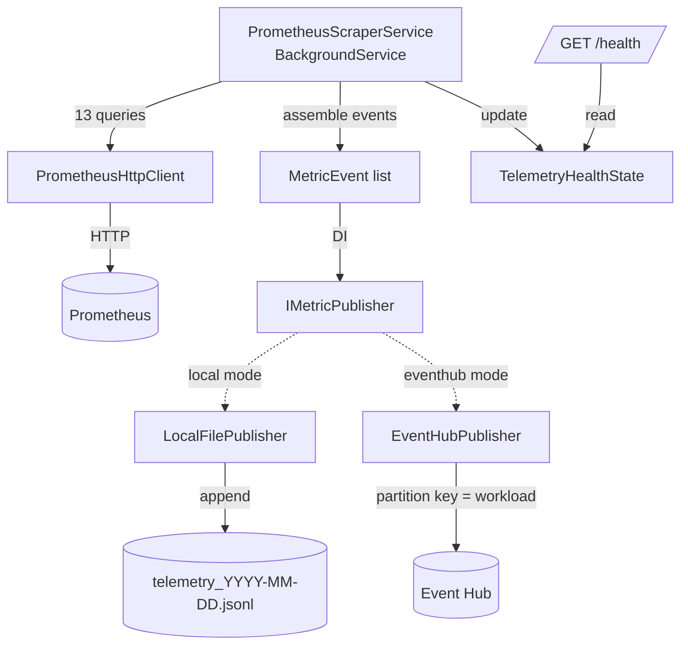

# Telemetry Service

ASP.NET Core 8 background worker that scrapes Prometheus every 15 seconds,
assembles `MetricEvent` records, and publishes them to either a local JSONL
file (dev) or Azure Event Hub (Phase 8 production).

Source: [`src/api/telemetry/`](../src/api/telemetry/) · Tests:
[`tests/AFIE.Telemetry.Tests/`](../tests/AFIE.Telemetry.Tests/)

## 1. Responsibilities

- Query Prometheus for the 13 PromQL expressions that feed the 47-dim state
  vector.
- Join per-pod results across queries and emit one `MetricEvent` per pod.
- Persist events reliably (append-only file today, partitioned Event Hub
  later).
- Expose `/health` with staleness detection so Kubernetes can restart the
  pod when scraping falls behind.

Not responsible for: feature normalisation, sliding windows, or state
vector assembly — those live in the (planned) feature engineering service.

## 2. Public surface

### 2.1 HTTP endpoints

| Verb | Path | Purpose |
| --- | --- | --- |
| GET | `/health` | Liveness + readiness. Returns `Healthy` / `Degraded` with `lastScrapeTime`, `eventsPublishedTotal`, `prometheusReachable`. Degraded if no scrape yet, or last scrape older than `2 × ScrapingIntervalSeconds`, or Prometheus unreachable. |

There is no ingress endpoint — the service pulls, never pushes. Data
consumers read from the JSONL sink (or Event Hub in Phase 8).

### 2.2 Configuration

Configured via `appsettings.json` and overridable with `Telemetry__*`
environment variables (double underscore = `:` in ASP.NET config).

```json
{
  "Telemetry": {
    "PrometheusUrl": "http://kube-prometheus-stack-prometheus.monitoring.svc:9090",
    "ScrapingIntervalSeconds": 15,
    "OutputMode": "local",
    "OutputPath": "experiments/results"
  },
  "EventHub": {
    "FullyQualifiedNamespace": "",
    "EventHubName": "telemetry-events"
  }
}
```

| Key | Type | Default | Notes |
| --- | --- | --- | --- |
| `Telemetry:PrometheusUrl` | URL | required | In-cluster DNS in prod; `http://localhost:9090` when using `kubectl port-forward` |
| `Telemetry:ScrapingIntervalSeconds` | int | `15` | Also drives the `/health` staleness threshold (`2×`) |
| `Telemetry:OutputMode` | `local` \| `eventhub` | `local` | Switches the DI binding of `IMetricPublisher` |
| `Telemetry:OutputPath` | path | `experiments/results` | Only used when `OutputMode=local` |
| `EventHub:FullyQualifiedNamespace` | FQDN | empty | e.g. `afie-eventhub-ns.servicebus.windows.net` |
| `EventHub:EventHubName` | string | `telemetry-events` | Uses `DefaultAzureCredential` for auth |

## 3. Internals



### 3.1 PrometheusScraperService

- `BackgroundService` with an infinite `await Task.Delay(interval)` loop.
- Fires all 13 queries in parallel via `Task.WhenAll` in
  `FetchAllMetricsAsync`.
- Catches every exception except `OperationCanceledException`, logs, and
  flips `PrometheusReachable = false`. The loop **never** propagates —
  transient Prometheus outages must not crash the pod, or the deployment's
  liveness probe would enter a restart storm alongside the outage.
- Derives workload name from pod name via two regex passes
  (ReplicaSet then StatefulSet). Anything unmatched falls back to the raw
  pod name — safer than dropping the event.

### 3.2 PrometheusHttpClient

- Thin wrapper over `HttpClient`, injected via `IHttpClientFactory` with
  `BaseAddress` and a 10s timeout set in `Program.cs`.
- Exposes `QueryAsync` (instant) and `QueryRangeAsync` (range) — only the
  instant form is used today; the range form is there so downstream
  services can share the client without duplicating deserialisation.
- Deserialises into typed records under `Models/PrometheusResponse.cs`.
- Returns `[]` on any error — the caller (scraper) then produces an empty
  `MetricEvent` list for that cycle. This is intentional: partial data is
  worse than a skipped cycle.

### 3.3 PrometheusQueries

Static class holding the 13 PromQL strings, plus `AllInstantQueries()`
which returns a `Dictionary<name, query>` for parallel execution.

| Key | PromQL summary |
| --- | --- |
| `CpuUsageRate` | `rate(container_cpu_usage_seconds_total[5m])` by pod |
| `MemoryBytes` | `container_memory_working_set_bytes` by pod |
| `RequestRate` | `rate(http_requests_total[5m])` by pod |
| `ErrorRate` | 5xx rate / total rate × 100 by pod |
| `LatencyP50/P95/P99` | `histogram_quantile(q, sum(rate(http_request_duration_seconds_bucket[5m])) by (le, pod, namespace))` |
| `CpuRequests/CpuLimits` | `kube_pod_container_resource_{requests,limits}{resource="cpu"}` |
| `MemRequests/MemLimits` | same, `resource="memory"` |
| `NodeCpuPressure` | `kube_node_status_condition{condition="PIDPressure",status="true"}` |
| `NodeMemPressure` | `kube_node_status_condition{condition="MemoryPressure",status="true"}` |

Known drift: `NodeCpuPressure` currently uses `PIDPressure`, which is
process-table pressure, not CPU load. `kube_node_status_condition` has no
literal `CPUPressure`; a load-based signal (e.g.
`node_load1 / count(node_cpu_seconds_total{mode="idle"})`) would match the
workflow doc's intent better. Tracked for a follow-up.

### 3.4 MetricEvent

16-field immutable record — see [`Models/MetricEvents.cs`](../src/api/telemetry/Models/MetricEvents.cs).

| Field | Type | Unit |
| --- | --- | --- |
| WorkloadName, Namespace | string | — |
| Timestamp | DateTimeOffset | UTC |
| CpuUsageRate | double | cores |
| MemoryBytes | long | bytes |
| RequestRatePerSecond | double | req/s |
| ErrorRatePct | double | percent |
| LatencyP50Ms, LatencyP95Ms, LatencyP99Ms | double | milliseconds (converted from Prometheus seconds) |
| NodeCpuPressure, NodeMemPressure | bool | flag |
| CpuRequest, CpuLimit | double | cores |
| MemRequest, MemLimit | double | bytes |

### 3.5 Publishers

Both implement `IMetricPublisher` and are wired in `Program.cs` based on
`Telemetry:OutputMode`:

- **LocalFilePublisher.** Appends camelCase JSONL to
  `{OutputPath}/telemetry_{yyyy-MM-dd}.jsonl`. Guarded by a
  `SemaphoreSlim(1,1)` so concurrent scrape cycles don't interleave.
  Files roll daily by UTC date.
- **EventHubPublisher.** Groups events by `WorkloadName` and sends one
  batch per group with the workload name as the partition key — this
  guarantees ordering per workload downstream. Authenticates with
  `DefaultAzureCredential` (managed identity in AKS, `az login` locally).
  Written today but only wired when `OutputMode=eventhub`, which will
  first happen in Phase 8.

## 4. Deployment

### 4.1 Container image

Multi-stage [`Dockerfile`](../src/api/telemetry/Dockerfile):

- `mcr.microsoft.com/dotnet/sdk:8.0` for build.
- `mcr.microsoft.com/dotnet/aspnet:8.0-alpine` for runtime.
- Listens on `:8080`.
- Runtime creates `/app/data` for the mounted `emptyDir` volume.

### 4.2 Kubernetes manifest

[`infra/gitops/manifests/telemetry-deployment.yaml`](../infra/gitops/manifests/telemetry-deployment.yaml):

- Namespace `afie-system`, 1 replica.
- `imagePullPolicy: IfNotPresent` — image is side-loaded with
  `kind load docker-image`.
- Env: `Telemetry__PrometheusUrl` points at the in-cluster Prometheus
  service; `Telemetry__OutputPath` overrides to `/app/data`.
- Liveness and readiness probes both hit `/health`.
- Requests 50m CPU / 64Mi memory; limits 200m / 128Mi.
- `emptyDir` volume at `/app/data` — data does not survive pod restart
  (this is intentional in dev; Phase 8 switches to Event Hub for
  durability).

### 4.3 Local deploy loop

```bash
# from repo root, after Phase 2 bootstrap
docker build -t afie-telemetry:dev -f src/api/telemetry/Dockerfile .
kind load docker-image afie-telemetry:dev --name afie-dev
kubectl apply -f infra/gitops/manifests/telemetry-deployment.yaml
kubectl -n afie-system rollout status deploy/afie-telemetry
kubectl -n afie-system port-forward svc/afie-telemetry 8080:8080
curl -s localhost:8080/health | jq
```

## 5. Testing

xUnit suite at [`tests/AFIE.Telemetry.Tests`](../tests/AFIE.Telemetry.Tests):

- `Clients/PrometheusHttpClientTests` — feeds captured Prometheus JSON
  fixtures through a mocked `HttpMessageHandler`; asserts deserialisation
  and error handling.
- `Models/MetricEventTests` — value-equality and JSON round-trip.
- `Publishers/LocalFilePublisherTests` — writes to a temp dir, asserts
  daily filename shape, append semantics, JSON validity, and no-op on
  empty input.

Run:

```bash
dotnet test tests/AFIE.Telemetry.Tests/AFIE.Telemetry.Tests.csproj
```

Coverage target per the workflow doc: 100% on `PrometheusHttpClient` and
`MetricEvent`. Scraper + publishers are covered functionally; the scraper's
Prometheus join is best tested end-to-end against a real Prometheus (see
integration test backlog in [roadmap.md](roadmap.md)).

## 6. Failure modes and operational notes

| Failure | What happens | Signal |
| --- | --- | --- |
| Prometheus down | Scraper logs error, marks `PrometheusReachable=false`, `/health` goes `Degraded`, no events published | `/health`, pod log |
| Individual query fails | Client returns `[]`, that field defaults to `0` in `MetricEvent`. Other queries in the same cycle still succeed | client log |
| Publisher throws (disk full, EH auth) | Caught in scrape loop; cycle marked failed; loop continues | scraper log, `/health` staleness |
| Long GC / clock skew | `/health` `staleness` field diverges from `ScrapingIntervalSeconds`; probes flag `Degraded` after 2× interval | `/health` |
| Pod restart under `local` mode | In-flight `emptyDir` file lost; next scrape starts a new file for today's date | expected in dev |

## 7. What changes in Phase 8

- Set `Telemetry__OutputMode=eventhub` and populate `EventHub__*`.
- Deployment gets a managed identity with `Azure Event Hubs Data Sender`
  on the target namespace.
- `emptyDir` volume is removed; there is no local sink to preserve.
- Feature engineering swaps from JSONL tailing to `EventProcessorClient`.

No code change is required for the switch — the DI binding in `Program.cs`
already selects the publisher from config.
